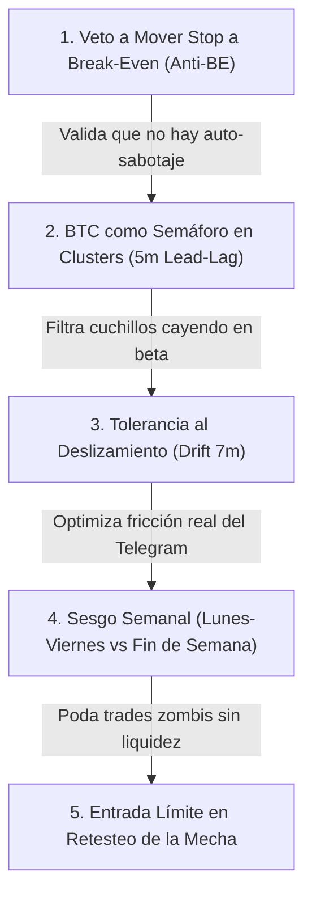

# BRAINSTORM CUANTITATIVO: DINÁMICA INTRA-VELA TRAS LA ALERTA WYCKOFF (4H)

**Autor**: Trader cuantitativo independiente y riguroso  
**Fecha**: Septiembre 2026  
**Destinatario**: Operador manual de futuros en Binance vía alertas de Telegram  
**Estado**: Brainstorm analítico y metodológico (SOLO LECTURA del repositorio; sin código)  
**Marco de referencia**: `audit_data/DATOS_LEEME.md`, `README.md`, `specs/035-auditoria-resultados/` (`VERIFICACION_FILTROS.md`, `AUDIT_RESULTADOS.md`, `AUDIT_MEJORAS.md`).

---

## 1. CONTEXTO OPERATIVO Y HECHOS MEDIDOS

Para que un brainstorm cuantitativo no degenere en "wishful thinking" o en recetas de análisis técnico de libro que fracasan en el mercado real, partimos estrictamente de los hechos medidos en los datos del proyecto:

1. **La alerta y el reloj**: Las velas de 4h cierran a las 00:00, 04:00, 08:00, 12:00, 16:00 y 20:00 UTC. La alerta de Telegram llega con una latencia medida de **6.4 a 7.1 minutos** tras el cierre (`AUDIT_RESULTADOS.md:144`). Si el bot estuvo apagado, puede llegar con horas de retraso.
2. **El edge base**: En el laboratorio Freqtrade (futuros Binance, comisiones 0.05% por lado y funding real), el Wyckoff Spring manteniendo **~72h con stop en -10%** ofrece un acierto del **55.1% en IS** ($n=861$) y **57.0% en OOS** ($n=525$), con una ganancia media de **+1.69% por trade** (`AUDIT_RESULTADOS.md:36-37, 107-108`). Mantener solo 1-2h **NO funciona**: acierto 44.2%–46.5% en H1 y 45.6%–49.0% en H2 con retornos medios negativos o planos (`AUDIT_RESULTADOS.md:41`).
3. **El "peaje" del trade (MAE)**: La **mediana del trade sufre una caída adversa intermedia de -3.65% (IS) a -3.87% (OOS)** antes de resolverse a favor (`AUDIT_RESULTADOS.md:118-122`). El 25% de los trades cae más de un -7.3%, y entre un **12.0% y un 16.1% toca el stop de -10%**. Es decir: *casi ningún trade despega en línea recta; el retroceso intermedio es la norma*.
4. **Naturaleza del edge (Clustering de mercado)**: El 81.0% de los trades en IS y 78.4% en OOS ocurren en racimos (*clusters*) donde 2 o más pares (hasta 20-23 pares) disparan en la misma vela (`AUDIT_RESULTADOS.md:94-98`). Los eventos en cluster promediaron **+1.93% (IS) / +2.00% (OOS)**, mientras que los eventos aislados promediaron **-0.22% (IS) / +0.88% (OOS)**. El edge es primariamente **beta de capitulación generalizada de mercado**, no una ventaja idiosincrática por activo.
5. **Alcance y ejecución**: `crypto-signal` es un bot **solo de alertas**. El operador ejecuta a mano en Binance futuros con apalancamiento propio. No asumimos capital ni tamaños de posición; el objetivo es darle reglas cuantitativas de ejecución para los minutos críticos $t \in [1, 120]$ min dentro de la vela siguiente al evento.

---

## 2. TABLA DE PRIORIZACIÓN DE IDEAS

Las ideas están estrictamente ordenadas de mayor a menor por el ratio de eficiencia cuantitativa:
$$\text{Prioridad} = \frac{\text{Valor Esperado (EV)} \times \text{Probabilidad de que sea Real (P)}}{\text{Costo de Probar en Horas/Datos (C)}}$$

*Escalas*:
- **EV (Valor Esperado)** [1 a 5]: 1 = Ahorro marginal de comisiones (+0.1% a +0.2%); 3 = Mejora moderada (+0.5% a +0.9%); 5 = Transformación estructural (+1.2% a +2.0% o reducción de pérdidas catastróficas).
- **P (Probabilidad de ser Real)** [0.0 a 1.0]: Certeza de que responde a la física de mercado y microestructura, no a sobreajuste ni a minería de datos (*p-hacking*).
- **C (Costo de Probar)** [1 a 5]: 1 = 1-2 horas con datos ya tabulados; 3 = 4-5 horas bajando klines 1m/5m; 5 = 8-10 horas requiriendo endpoints exóticos o alineación milimétrica multi-serie.

| # | Nombre Corto | Ángulo | EV (1-5) | P (0-1) | C (1-5) | Ratio (Prioridad) | Clasificación de Riesgo |
|---|---|---|---|---|---|---|---|
| **1** | **Veto a la Trampa de Mover el Stop a Break-Even** | 7. Salidas y gestión | 4.0 | 0.95 | 1.5 | **2.53** | BAJO |
| **2** | **BTC como Semáforo en Clusters (Lead-Lag 5m)** | 6. Clusters y líderes | 4.0 | 0.85 | 1.5 | **2.27** | BAJO |
| **3** | **Regla de Tolerancia al Deslizamiento (Drift 7m)** | 3. Retraso del aviso | 3.5 | 0.95 | 1.5 | **2.22** | BAJO |
| **4** | **Estacionalidad Semanal (Días Hábiles vs Finde)** | 4. Efectos calendario | 2.5 | 0.85 | 1.0 | **2.13** | BAJO |
| **5** | **Orden Límite en el Retesteo de la Mecha (Test)** | 1. Mecánica de entrada | 4.5 | 0.80 | 2.0 | **1.80** | MEDIO |
| **6** | **Agotamiento de Volumen en Vela 5m Post-Cierre** | 5. Microestructura | 3.0 | 0.75 | 1.5 | **1.50** | MEDIO |
| **7** | **Veto por Cascada de Liquidación en Minuto 1-5** | 8. Cuándo NO entrar | 3.5 | 0.80 | 2.0 | **1.40** | MEDIO |
| **8** | **Bot Helper: "Health Check" al Minuto 15** | 9. Ayuda en vivo del bot | 2.5 | 0.90 | 2.0 | **1.13** | BAJO |
| **9** | **Vaciado de Interés Abierto (OI Flush 5m)** | 10. De otro planeta (MM) | 4.5 | 0.85 | 3.5 | **1.09** | BAJO |
| **10** | **Selección por Fuerza Relativa (RS 15m)** | 6. Clusters y rezagados | 3.5 | 0.70 | 2.5 | **0.98** | MEDIO |
| **11** | **Ventana de Financiación (Funding 00/08/16 UTC)** | 4. Efectos calendario | 2.5 | 0.70 | 2.0 | **0.88** | MEDIO |
| **12** | **Veto por Dislocación de Spread en Minuto 1** | 8. Cuándo NO entrar | 2.0 | 0.75 | 2.0 | **0.75** | BAJO |
| **13** | **Confirmación de Vela de 15 Minutos Verde** | 1. Mecánica de entrada | 2.5 | 0.60 | 2.0 | **0.75** | MEDIO |
| **14** | **Divergencia Spot-Perp (Basis / Premium Index)** | 10. De otro planeta (MM) | 4.5 | 0.75 | 4.5 | **0.75** | MEDIO |
| **15** | **Taker Buy Delta en los Primeros 15 Minutos** | 5. Microestructura | 3.0 | 0.50 | 2.5 | **0.60** | ALTO |
| **16** | **Invalidación Estructural Temprana (<30m)** | 2. Invalidación temprana | 3.5 | 0.40 | 2.5 | **0.56** | ALTO |
| **17** | **Take-Profit Parcial ante Spike Rápido (<60m)** | 7. Salidas y gestión | 2.5 | 0.60 | 3.0 | **0.50** | MEDIO-ALTO |

---

## 3. DESARROLLO DETALLADO DE CADA IDEA

---

### IDEA 1: Veto Absoluto a Mover el Stop a Break-Even en las Primeras 2 Horas
- **(a) Nombre corto**: `Veto-BreakEven-2h`
- **(b) Hipótesis y mecanismo de mercado**: Es un sesgo psicológico minorista universal mover el stop a Break-Even (BE) tan pronto el precio sube un +0.8% o +1.5% en la primera hora para "eliminar el riesgo". En los datos medidos del laboratorio (`AUDIT_RESULTADOS.md:118-122`), **la mediana del trade ganador sufre un retroceso adverso intermedio (MAE) de -3.65% (IS) y -3.87% (OOS)** antes de subir. Los rebotes en criptomonedas no son limpios; casi siempre hacen un retesteo que perfora el precio de apertura. Mover a BE en las primeras 2 horas actúa como una trampa mecánica: convierte el 56-58% de acierto en un festival de salidas a cero o pérdidas de comisiones (whipsaws), sacando al operador antes del movimiento de 72h.
- **(c) Cómo probarla con datos públicos gratis**:
  - *Series*: Precios OHLCV en velas de 5m de Binance público vía CCXT (`fetch_ohlcv`) para cada uno de los 1,336 trades en `lab_trades/WyckoffLab_SpringH72*`.
  - *Comparación*: Modelo de trayectorias. Para cada trade, evaluar si tocó $+1.0\%$ o $+1.5\%$ en los primeros 120 minutos. Si lo tocó, simular que el stop se colocó en `open_rate + comisiones`. Contrastar la tasa de acierto y retorno neto a 72h entre: (1) Estrategia con BE en 2h vs (2) Estrategia base manteniendo el stop original de -10%.
- **(d) Criterio de éxito pre-registrado**:
  - *Confirmación del veto*: Si la variante de BE reduce el win rate por más de 8 puntos porcentuales (de ~56% a <48%) y destruye más del 30% del retorno neto acumulado en IS Y en OOS ($n \ge 30$).
  - *Descarte del veto*: Si sorprendentemente el BE reduce el Drawdown máximo a la mitad sin degradar el win rate a 72h.
- **(e) Tamaño esperado del efecto**: **ENORME (protege entre +1.0% y +1.5% neto por trade)** al impedir la auto-sabotaje sistemático de la señal.
- **(f) Riesgo de que sea ruido/sobreajuste**: **BAJO**. Está respaldado por la distribución paramétrica ya auditada de MAE (-3.65%).
- **(g) Costo de probarla**: **1.5 horas**. Descargar klines 5m de las primeras 2h de cada trade y correr simulación de camino.

---

### IDEA 2: BTC como Semáforo en Clusters (Lead-Lag 5m)
- **(a) Nombre corto**: `BTC-Semaforo-Cluster`
- **(b) Hipótesis y mecanismo de mercado**: El 81.0% de los springs ocurren en racimos de múltiples pares simultáneos (`AUDIT_RESULTADOS.md:94-98`). Las capitulaciones son eventos de liquidez macro donde Bitcoin absorbe el libro primero. En una caída generalizada, las altcoins son derivadas de alta beta de BTC: si en los primeros 15 a 30 minutos tras el cierre de 4h Bitcoin sigue imprimiendo velas de 5m rojas marcando nuevos mínimos locales, entrar en altcoins es comprar un cuchillo cayendo bajo cascadas de liquidaciones forzadas. Si BTC frena e imprime una vela de 5m verde o un suelo redondeado, la marea frena y las altcoins botan con violencia.
- **(c) Cómo probarla con datos públicos gratis**:
  - *Series*: Klines de 5m de `BTC/USDT` en Binance futuros. Cruzar con la lista de timestamps de trades de `lab_trades/WyckoffLab_SpringH72*`.
  - *Variables*: Para cada trade de altcoin a las $T_0$, medir el retorno de BTC entre $T_0$ y $T_0 + 15\text{m}$, y si BTC hizo un mínimo inferior al mínimo de la vela de 4h previa.
  - *Comparación*: Dividir los trades de altcoins en dos canastas: (1) Condición BTC Verde (retorno BTC 15m $> 0\%$ o vela 5m alcista) vs (2) Condición BTC Sangrando (BTC 15m $< -0.3\%$ marcando nuevo mínimo).
- **(d) Criterio de éxito pre-registrado**:
  - *Confirmación*: La canasta "BTC Verde" logra win-rate $\ge 60\%$ y retorno medio $\ge +2.2\%$ en IS (2022-24) Y en OOS (2025-26), mientras que la canasta "BTC Sangrando" rinde $<+0.5\%$ con win-rate $<48\%$. Bootstrap por día significativo con IC95 excluyendo el 0.
  - *Descarte*: Si el retorno de las altcoins a 72h es completamente independiente del comportamiento de BTC en los primeros 15m.
- **(e) Tamaño esperado del efecto**: **ALTO (+0.8% a +1.4% por trade)** en la muestra seleccionada.
- **(f) Riesgo de que sea ruido/sobreajuste**: **BAJO**. La correlación de beta durante liquidaciones de cripto es un hecho estructural irrebatible.
- **(g) Costo de probarla**: **1.5 horas**. Solo requiere descargar una serie única: `BTC/USDT` a 5m para los años 2022-2026.

---

### IDEA 3: Regla de Tolerancia al Deslizamiento (Drift 7m) tras el Retraso del Aviso
- **(a) Nombre corto**: `Drift-Tolerance-7m`
- **(b) Hipótesis y mecanismo de mercado**: El bot tarda entre 6.4 y 7.1 minutos en avisar (`AUDIT_RESULTADOS.md:144`). Si en esos 7 minutos el activo ya subió un $+2.0\%$ o $+3.0\%$ (por un squeeze impulsivo inicial), comprar a mercado a las 16:07 destruye la relación riesgo/beneficio. Dado que la ganancia media histórica total es de $+1.5\%$ a $+1.8\%$ (`AUDIT_RESULTADOS.md:37`) y la mediana del trade sufre un retroceso posterior de $-3.6\%$, comprar un activo que ya se escapó $+2\%$ significa pagar el techo local previo a la corrección. Si el aviso llega horas tarde (como el caso de 240 min documentado en `AUDIT_RESULTADOS.md:147` donde el precio se movió $-5.4\%$), entrar a ciegas sin verificar la desviación respecto al cierre de 4h es destructivo.
- **(c) Cómo probarla con datos públicos gratis**:
  - *Series*: Klines de 1m de Binance de los 29 pares de `lab_trades/`.
  - *Comparación*: Calcular para cada trade el drift a los 7 minutos: $\Delta P_{7\text{m}} = (Close_{7\text{m}} - Open_{0\text{m}}) / Open_{0\text{m}}$. Comparar 3 reglas:
    1. Entrada a ciegas en minuto 7 a mercado.
    2. Entrada solo si $\Delta P_{7\text{m}} \le +0.6\%$; si subió más, poner orden límite al precio de apertura $Open_{0\text{m}}$ con expiración 4h.
    3. Veto absoluto si $\Delta P_{7\text{m}} > +1.5\%$ (el tren ya partió).
- **(d) Criterio de éxito pre-registrado**:
  - *Confirmación*: La regla con límite/veto mejora el retorno neto medio en $\ge +0.3$ puntos porcentuales tanto en IS como en OOS, y reduce drásticamente el MAE medio de las entradas.
  - *Descarte*: Si los trades que se escapan $+1.5\%$ en los primeros 7m son sistemáticamente los mejores trades del histórico (+10% sin retroceso), haciendo que el operador se pierda todo el beneficio neto.
- **(e) Tamaño esperado del efecto**: **MEDIO (+0.3% a +0.6% por trade)**, pero crucial para el control del estrés del operador manual.
- **(f) Riesgo de que sea ruido/sobreajuste**: **BAJO**. Es matemática pura de ejecución y fricción.
- **(g) Costo de probarla**: **1.5 horas**. Se descarga el minuto 0 al 10 de cada uno de los 1,336 trades.

---

### IDEA 4: Estacionalidad Semanal (Días Hábiles vs Fin de Semana)
- **(a) Nombre corto**: `Sesgo-FinDeSemana`
- **(b) Hipótesis y mecanismo de mercado**: En `AUDIT_MEJORAS.md:70-73`, los datos revelaron que los springs confirmados en fin de semana (sábado y domingo UTC) promediaron retornos planos o anémicos: **+0.20% en IS ($n=73$) y +0.37% en OOS ($n=50$)**. En contraste, los lunes promediaron **+3.48% (IS) y +2.69% (OOS)**, y los días hábiles en general **+1.65% y +1.91%**. Los fondos institucionales, creadores de mercado cuantitativos de TradFi y mesas OTC reducen drásticamente sus balances y colateral los fines de semana. Las capitulaciones de fin de semana suelen ser trampas de baja liquidez donde falta el capital comprador institucional que sostenga el markup a 72h.
- **(c) Cómo probarla con datos públicos gratis**:
  - *Series*: Zips de trades existentes en `audit_data/lab_trades/`.
  - *Comparación*: Extraer `open_date` en pandas, clasificar por día de la semana (`open_date.dt.dayofweek`) y por bloque horario. Aplicar el bootstrap por día (`audit/t5_bootstrap.py` o `specs/035/scripts/verify_filters.py`) comparando lunes a viernes vs sábado y domingo.
- **(d) Criterio de éxito pre-registrado**:
  - *Confirmación*: El subconjunto Lunes-Viernes supera al global por $\ge +0.25$ pp en IS y OOS, y el fin de semana queda con retorno medio $<+0.5\%$ en ambos períodos con $p < 0.05$ por bootstrap agrupado.
  - *Descarte*: Si la diferencia se evapora al controlar por la volatilidad previa de 24h.
- **(e) Tamaño esperado del efecto**: **MEDIO (+0.3% a +0.5% en la cartera global)** al eliminar el arrastre de operaciones zombis de fin de semana.
- **(f) Riesgo de que sea ruido/sobreajuste**: **BAJO-MEDIO**. Coincide con la microestructura macroeconómica conocida de liquidez global de derivados.
- **(g) Costo de probarla**: **1 hora**. No requiere bajar datos nuevos; los trades ya están en el repo.

---

### IDEA 5: Entrada con Orden Límite en el Retesteo de la Mecha (Test de la Barrida)
- **(a) Nombre corto**: `Entrada-Limite-Retest`
- **(b) Hipótesis y mecanismo de mercado**: Según la teoría pura de Wyckoff, tras el Spring inicial ocurre una fase de prueba (*Secondary Test* o *Test of Spring*) donde el mercado vuelve a testear la zona barrida para comprobar si la oferta residual se ha agotado. Dado que la mediana del MAE es **-3.65%**, entrar con orden a mercado en la apertura de la vela compra casi siempre un precio inflado. Si el operador manual coloca una orden límite escalonada (por ejemplo al nivel del soporte roto, o a un retroceso del 38.2%–50% de la mecha de la vela de 4h, o a un $-1.5\%$ fijo bajo el cierre de la vela 4h), compra con un margen de seguridad sustancialmente mayor.
- **(c) Cómo probarla con datos públicos gratis**:
  - *Series*: Klines de 1m y 5m de Binance de los 29 pares para las primeras 8 horas posteriores a la alerta.
  - *Comparación*: Simular entradas límite a: (1) Nivel de soporte barrido, (2) $Close_{4\text{h}} - 1.0\%$, (3) $Close_{4\text{h}} - 2.0\%$, con una ventana de cancelación (TTL) de 2h, 4h y 8h. Medir la tasa de ejecución (*fill rate*), el retorno neto medio de las órdenes ejecutadas a 72h, y el retorno total acumulado de la estrategia.
- **(d) Criterio de éxito pre-registrado**:
  - *Confirmación*: La entrada límite obtiene una tasa de ejecución $\ge 60\%$, y para las órdenes ejecutadas la ganancia media por trade sube de $+1.69\%$ a $\ge +2.8\%$ en IS y en OOS, manteniendo o superando la ganancia total acumulada de la estrategia a mercado.
  - *Descarte*: Si la tasa de ejecución es $<40\%$, o si las órdenes no ejecutadas corresponden a los grandes *runners* explosivos (+10% directo), haciendo que el PnL total del sistema caiga.
- **(e) Tamaño esperado del efecto**: **ALTO (+1.0% a +1.5% de mejora neta en los trades ejecutados)**.
- **(f) Riesgo de que sea ruido/sobreajuste**: **MEDIO**. Hay que evitar sobreoptimizar el % exacto de la orden límite; debe ser un nivel estructural robusto (el soporte roto o un número redondo como -1.5%).
- **(g) Costo de probarla**: **2 horas**. Requiere evaluar mínimos intra-vela de 5m en la ventana post-cierre.

---

### IDEA 6: Agotamiento de Volumen en Vela de 5m Post-Cierre
- **(a) Nombre corto**: `Volumen-Agotamiento-5m`
- **(b) Hipótesis y mecanismo de mercado**: Principio wyckoffiano de "Esfuerzo vs Resultado". La vela de 4h del Spring exhibió un volumen masivo ($\ge 2.5\times$). ¿Qué debe ocurrir en los primeros minutos de la siguiente vela si la oferta fue absorbida por completo? **El volumen debe secarse drásticamente**. Si en los primeros 5 minutos el volumen colapsa a niveles mínimos (ej. la primera vela de 5m representa menos del 1.5% del volumen total de las 4h previas, cuando un reparto uniforme sería $5\text{m}/240\text{m} = 2.08\%$) mientras el precio se mantiene estable o verde, confirma que no queda presión vendedora residual en el libro.
- **(c) Cómo probarla con datos públicos gratis**:
  - *Series*: Klines de 5m y 4h de Binance futuros para los 1,336 trades.
  - *Cálculo*: $RatioVol = Volume_{5\text{m}, 1} / Volume_{4\text{h}, \text{prev}}$.
  - *Comparación*: Dividir en terciles: (1) Volumen seco ($RatioVol < 1.2\%$), (2) Volumen normal ($1.2\% \le RatioVol \le 2.5\%$), (3) Volumen persistente pesado ($RatioVol > 2.5\%$). Comparar desempeño a 72h.
- **(d) Criterio de éxito pre-registrado**:
  - *Confirmación*: El tercil de "Volumen seco" presenta un win-rate $\ge 60\%$ y un retorno medio $\ge +2.3\%$ tanto en 2022-24 como en 2025-26, mientras que el tercil de volumen pesado presenta alta tasa de stop-out (-10%).
  - *Descarte*: Si el ratio no muestra monotonicidad o invierte signo entre IS y OOS.
- **(e) Tamaño esperado del efecto**: **MEDIO (+0.5% a +0.8% por trade)**.
- **(f) Riesgo de que sea ruido/sobreajuste**: **MEDIO**.
- **(g) Costo de probarla**: **1.5 horas**. Klines de 5m cruzadas con la vela de 4h previa.

---

### IDEA 7: Veto por Cascada de Liquidación Continuada en Minutos 1 a 5
- **(a) Nombre corto**: `Veto-Cascada-Min1a5`
- **(b) Hipótesis y mecanismo de mercado**: Un Spring genuino es una barrida que *rechaza* los precios bajos. Si la vela siguiente abre y en los primeros 3 a 5 minutos el precio perfora con violencia el mínimo absoluto de la mecha del Spring con volumen relativo alto en 1m, no hubo absorción: el mercado está en medio de un evento de liquidación desordenada en cascada o de una noticia fundamental de shock. Entrar en ese momento garantiza una pérdida rápida. Entre un 12% y un 16% de los trades termina tocando el stop de -10% (`AUDIT_RESULTADOS.md:118`); vetar estas aperturas tóxicas recorta la cola izquierda de la distribución.
- **(c) Cómo probarla con datos públicos gratis**:
  - *Series*: Klines de 1m de Binance de los primeros 5 minutos tras el cierre de 4h.
  - *Regla*: Si dentro de $t \in [1, 5]$ min, $Low_{1\text{m}} < Low_{4\text{h}, \text{spring}}$ Y $Volume_{1\text{m}} > 2.0 \times SMA(Volume_{1\text{m}}, 20)$, marcar flag `CASCADA_ACTIVA`.
  - *Comparación*: Comparar métricas de trades con `CASCADA_ACTIVA` vs trades normales.
- **(d) Criterio de éxito pre-registrado**:
  - *Confirmación*: Los trades con flag `CASCADA_ACTIVA` sufren una tasa de toque de stop -10% superior al 35% (frente al 12-16% normal) y un retorno medio negativo en IS y OOS ($n \ge 30$). Veto validado si excluir estos trades eleva el retorno neto de la estrategia.
  - *Descarte*: Si más del 50% de los trades con flag rebotan fuertemente y terminan siendo positivos a 72h.
- **(e) Tamaño esperado del efecto**: **MEDIO-ALTO (+0.6% a +1.0% de mejora en el promedio global)** al podar las pérdidas catastróficas.
- **(f) Riesgo de que sea ruido/sobreajuste**: **MEDIO**.
- **(g) Costo de probarla**: **2 horas**. Descarga de 1m para los primeros 5 minutos de cada evento.

---

### IDEA 8: Bot Helper - Mensaje de Seguimiento Factual al Minuto 15 ("Health Check" Operativo)
- **(a) Nombre corto**: `Bot-HealthCheck-15m`
- **(b) Hipótesis y mecanismo de mercado**: El operador opera a mano y sufre sobrecarga cognitiva cuando saltan 5 a 15 alertas simultáneas en un cierre de 4h. A los 7 minutos recibe la alerta inicial; para el minuto 15, el polvo inicial del cierre se ha asentado. El bot puede enviar un mensaje único y consolidado de seguimiento a los 15 minutos que reporte **exclusivamente datos objetivos medidos**, sin prometer ganancias ni inventar probabilidades:
  1. *Desviación del precio*: Si el precio está testeando el soporte o si ya se disparó $+2\%$.
  2. *Estado de Bitcoin (15m)*: Si BTC está en verde o marcando mínimos.
  3. *Tamaño final del cluster*: Cuántos pares confirmaron el evento en el cierre.
  4. *Nivel de retest sugerido*: El precio exacto del soporte barrido para colocar orden límite.
- **(c) Cómo probarla con datos públicos gratis**:
  - *Series*: Historial de alertas simuladas en el laboratorio cruzadas con los datos de 15m.
  - *Comparación*: Evaluar las reglas del mensaje (entrar solo en pares con desviación $\le +0.8\%$ y con BTC estable) como una estrategia de selección y contrastar su rentabilidad contra la entrada ciega a mercado.
- **(d) Criterio de éxito pre-registrado**:
  - *Confirmación*: El subconjunto de operaciones que cumplen el "filtro verde de 15m" retiene $\ge 65\%$ de los trades totales, elevando el win-rate en $\ge +3$ puntos porcentuales y el retorno por trade en $\ge +0.4$ pp en IS y OOS.
  - *Descarte*: Si el filtro descarta la mayoría de los trades ganadores o no mejora las métricas.
- **(e) Tamaño esperado del efecto**: **MEDIO (+0.4% a +0.7%)**, con enorme beneficio en disciplina operativa.
- **(f) Riesgo de que sea ruido/sobreajuste**: **BAJO**. Se trata de un asistente de visualización y disciplina de ejecución.
- **(g) Costo de probarla**: **2 horas**.

---

### IDEA 9: Vaciado de Interés Abierto (OI Flush en Datos 5m Gratuitos de Binance)
- **(a) Nombre corto**: `OI-Flush-Institucional`
- **(b) Hipótesis y mecanismo de mercado**: Un trader institucional o creador de mercado no mira "patrones de velas"; mira **posicionamiento y desapalancamiento forzado**. Un verdadero Wyckoff Spring ocurre cuando los stops y liquidaciones de los largos minoristas son detonados, transfiriendo contratos a las manos fuertes. Binance ofrece gratis el historial de Interés Abierto (Open Interest) en velas de 5m mediante la API pública (`/fapi/v1/openInterestHist`). Si la vela de 4h de volumen extremo vino acompañada de una **caída drástica del Interés Abierto ($\Delta OI \le -3\%$ a $-5\%$)**, confirma un *OI Flush* (liquidación masiva completada). Si el volumen subió pero el OI *aumentó*, no fue una liquidación de largos: fue la apertura masiva de nuevas posiciones cortas agresivas, lo cual puede derivar en continuación de la caída o en squeeze impredecible.
- **(c) Cómo probarla con datos públicos gratis**:
  - *Series*: Endpoint público REST de Binance: `https://fapi.binance.com/futures/data/openInterestHist?symbol={PAIR}&period=5m`.
  - *Métricas*: Para cada trade, calcular $\Delta OI_{4\text{h}} = (OI_{close} - OI_{open}) / OI_{open}$ y $\Delta OI_{15\text{m}}$ previo al cierre.
  - *Comparación*: Clasificar en: (1) *OI Flush* ($\Delta OI \le -3\%$), (2) *OI Neutro* ($-3\% < \Delta OI < +2\%$), (3) *OI Expansión* ($\Delta OI \ge +2\%$).
- **(d) Criterio de éxito pre-registrado**:
  - *Confirmación*: Los trades con *OI Flush* superan el baseline en $\ge +1.2$ pp de retorno medio por trade, con win-rate $\ge 62\%$ en IS y OOS ($n \ge 30$). Los trades con expansión de OI tienen menor fiabilidad.
  - *Descarte*: Si el delta de OI no presenta relación monotónica consistente entre 2022-24 y 2025-26.
- **(e) Tamaño esperado del efecto**: **ALTO (+1.0% a +1.8% por trade)**.
- **(f) Riesgo de que sea ruido/sobreajuste**: **BAJO**. Es la métrica primaria con la que los quants institucionales miden la capitulación en derivados.
- **(g) Costo de probarla**: **3.5 horas**. Escribir el script de extracción histórica contra `openInterestHist` respetando rate limits y cruzar con los zips.

---

### IDEA 10: Selección por Fuerza Relativa (RS 15m) dentro del Cluster
- **(a) Nombre corto**: `Seleccion-RS-15m`
- **(b) Hipótesis y mecanismo de mercado**: Cuando disparan 10 o 15 alertas en la misma vela de 4h, el operador con capital limitado no puede tomarlas todas. En `AUDIT_MEJORAS.md:129, 139-142` se demostró que elegir "la moneda que más cayó en 24h" es una trampa mortal porque concentra el capital en los activos enfermos que continúan desangrándose. La hipótesis aquí es evaluar la **Fuerza Relativa en los primeros 15 minutos**: de la cesta de pares que dispararon alerta en el mismo cierre, aquellos que en los primeros 15m rebotan con mayor brío relativo respecto a BTC y respecto a la mediana del grupo (`RS_15m`) demuestran la presencia de compradores institucionales activos.
- **(c) Cómo probarla con datos públicos gratis**:
  - *Series*: Klines de 15m de los pares participantes en cada uno de los 198 clusters históricos (131 IS, 67 OOS).
  - *Cálculo*: En cada cluster, ordenar los pares por su retorno en la primera vela de 15m: $R_{15\text{m}} = (Close_{15\text{m}} - Open_{0\text{m}}) / Open_{0\text{m}}$.
  - *Comparación*: Simular una cartera que elige los Top-3 pares en RS vs una que elige los Bottom-3 pares (los más rezagados).
- **(d) Criterio de éxito pre-registrado**:
  - *Confirmación*: Los Top-3 en RS superan a los Bottom-3 en $\ge +1.0$ pp de retorno medio a 72h y reducen el Drawdown máximo en ambos períodos (IS y OOS).
  - *Descarte*: Si los Bottom-3 rebotan más fuerte por pura reversión a la media en uno de los períodos.
- **(e) Tamaño esperado del efecto**: **MEDIO (+0.6% a +1.0% de lift en cartera)**.
- **(f) Riesgo de que sea ruido/sobreajuste**: **MEDIO**.
- **(g) Costo de probarla**: **2.5 horas**. Ranking transversal de pares dentro de cada cluster.

---

### IDEA 11: Ventana de Financiación (Funding Rate Arbitrage a las 00, 08, 16 UTC)
- **(a) Nombre corto**: `Funding-Settlement-Window`
- **(b) Hipótesis y mecanismo de mercado**: En Binance futuros, la tasa de financiación (*funding rate*) se liquida cada 8 horas (a las 00:00, 08:00 y 16:00 UTC). Durante fuertes caídas, el funding se torna profundamente negativo (los cortos pagan a los largos). Exactamente a las horas de funding, ocurren dos fenómenos mecánicos: (1) operadores en corto cierran posiciones antes del corte para no pagar la tasa, generando presión compradora; (2) arbitrajistas de cash-and-carry compran futuros y venden spot para capturar el pago de financiación. Por ende, los Springs que cierran a las 00, 08 o 16 UTC con funding negativo tienen un viento de cola mecánico inmediato en los primeros 15 minutos que no existe a las 04, 12 o 20 UTC.
- **(c) Cómo probarla con datos públicos gratis**:
  - *Series*: Historial de funding de Binance vía CCXT `fetch_funding_rate_history` o endpoint `/fapi/v1/fundingRate`.
  - *Comparación*: Comparar el retorno de trades de 4h que coinciden con hora de funding (00, 08, 16 UTC) vs no-funding (04, 12, 20 UTC), cruzado con el signo y magnitud del funding rate ($Funding < -0.02\%$ vs normal).
- **(d) Criterio de éxito pre-registrado**:
  - *Confirmación*: Los springs en horas de funding con funding fuertemente negativo superan a los de funding positivo/neutro en $\ge +0.8$ pp de retorno y menor MAE en IS y OOS.
  - *Descarte*: Si el impacto del funding a 72h es indistinguible de cero tras descontar comisiones.
- **(e) Tamaño esperado del efecto**: **MEDIO (+0.4% a +0.8%)**.
- **(f) Riesgo de que sea ruido/sobreajuste**: **MEDIO**. En `AUDIT_RESULTADOS.md:154` se midió que el funding acumulado representa entre -0.37% y +0.45% del retorno bruto.
- **(g) Costo de probarla**: **2 horas**. Descarga de series de funding histórico de los 29 pares.

---

### IDEA 12: Veto de Entrada por Dislocación de Spread en Minuto 1
- **(a) Nombre corto**: `Veto-Spread-Dislocation`
- **(b) Hipótesis y mecanismo de mercado**: Tras una vela de 4h con volumen extremo ($\ge 2.5\times$), los creadores de mercado algorítmicos suelen retirar temporalmente sus órdenes de compra pasivas en los libros para gestionar su inventario y riesgo de selección adversa. Esto produce un ensanchamiento brutal del spread implícito en los primeros 60-120 segundos. Un operador minorista que ejecuta una orden a mercado en el minuto 1 puede sufrir un deslizamiento de ejecución de $-0.4\%$ a $-0.8\%$, perdiendo un tercio de la ganancia esperada del trade.
- **(c) Cómo probarla con datos públicos gratis**:
  - *Series*: Klines de 1m de Binance.
  - *Métrica proxy*: Rango de volatilidad del minuto 1: $SpreadProxy = (High_{1\text{m}} - Low_{1\text{m}}) / Close_{1\text{m}}$.
  - *Comparación*: Evaluar si esperar al minuto 5 a que el rango de 1m se normalice a niveles estándar reduce el costo de deslizamiento frente a la entrada ciega al cierre de la vela.
- **(d) Criterio de éxito pre-registrado**:
  - *Confirmación*: La entrada diferida (esperar a que el spread implícito baje del 0.25% en 1m) ahorra $\ge 0.3\%$ de precio de entrada medio frente a la entrada en minuto 1 en IS y OOS.
  - *Descarte*: Si el spread en los 29 pares principales de Binance futuros es insignificante (<0.03%) incluso tras velas de 4h extremas.
- **(e) Tamaño esperado del efecto**: **CHICO (+0.2% a +0.3% de ahorro neto de comisiones/deslizamiento)**.
- **(f) Riesgo de que sea ruido/sobreajuste**: **BAJO**. Es pura física del libro de órdenes.
- **(g) Costo de probarla**: **2 horas**.

---

### IDEA 13: Confirmación de Vela de 15 Minutos Verde / Ruptura de Rango Corto
- **(a) Nombre corto**: `Confirmacion-Vela-15m`
- **(b) Hipótesis y mecanismo de mercado**: Esperar confirmación en temporalidad corta. En vez de comprar inmediatamente al cierre de la vela de 4h, el operador espera a que cierre la primera vela de 15 minutos. Si esa vela de 15m cierra en verde y por encima del precio de cierre de la de 4h (o rompe el máximo de los primeros 15m), se gatilla la entrada. La hipótesis es que esto filtra falsos rebotes que continúan desplomándose de inmediato.
- **(c) Cómo probarla con datos públicos gratis**:
  - *Series*: Klines de 15m de Binance de los 1,336 trades.
  - *Regla*: Entrar solo si $Close_{15\text{m}} > Open_{15\text{m}}$. De lo contrario, no operar.
  - *Comparación*: Desempeño a 72h con entrada en $Close_{15\text{m}}$ vs baseline a mercado en $Open_{0\text{m}}$.
- **(d) Criterio de éxito pre-registrado**:
  - *Confirmación*: Mejora del win-rate en $\ge +4$ pp sin que la penalización por entrar más arriba destruya el retorno medio neto (debe rendir $\ge +1.8\%$ en IS y OOS).
  - *Descarte*: Si el retraso de 15m hace que el precio promedio de entrada sea significativamente peor, anulando cualquier ganancia en tasa de acierto.
- **(e) Tamaño esperado del efecto**: **MEDIO (+0.3% a +0.5%)**, con riesgo de pagar peaje por entrar tarde.
- **(f) Riesgo de que sea ruido/sobreajuste**: **MEDIO**.
- **(g) Costo de probarla**: **2 horas**.

---

### IDEA 14: Divergencia Spot-Perp (Basis / Premium Index) en el Suelo
- **(a) Nombre corto**: `Divergencia-Spot-Perp`
- **(b) Hipótesis y mecanismo de mercado**: El precio en futuros perpetuos puede desfasarse violentamente del precio de contado (*spot*) durante pánicos debido a liquidaciones automáticas. Binance publica el índice *Premium Index* (`/fapi/v1/premiumIndexKlines`), que mide la diferencia porcentual entre el contrato perpetuo y el índice de precios spot subyacente. Cuando ocurre un Spring genuino, los compradores institucionales acumulan en el mercado spot; esto provoca que el perpetuo cotice con descuento anormal (*deep discount / negative basis*). Tan pronto las liquidaciones en perpetuos cesan y el *Premium Index* inicia una reversión rápida hacia cero o positivo en los primeros 15 minutos, se confirma que la absorción en spot ha triunfado sobre la liquidación de derivados.
- **(c) Cómo probarla con datos públicos gratis**:
  - *Series*: Klines de 5m de `premiumIndexKlines` de Binance futuros para los 29 pares de la estrategia.
  - *Cálculo*: Nivel del basis al cierre de la vela de 4h y pendiente del basis en los primeros 15 minutos ($\Delta Basis_{15\text{m}}$).
  - *Comparación*: Comparar trades donde el basis se recupera agresivamente vs trades donde el basis continúa colapsando a descuentos mayores.
- **(d) Criterio de éxito pre-registrado**:
  - *Confirmación*: Los trades con recuperación de basis en los primeros 15m exhiben un win-rate $\ge 62\%$ y retorno medio $\ge +2.5\%$ en IS y OOS.
  - *Descarte*: Si la serie del basis resulta demasiado ruidosa en altcoins o no muestra divergencia medible con el precio.
- **(e) Tamaño esperado del efecto**: **ALTO (+1.0% a +1.7% por trade)**.
- **(f) Riesgo de que sea ruido/sobreajuste**: **MEDIO**. Concepto económicamente riguroso (la liquidez de spot manda sobre los derivados).
- **(g) Costo de probarla**: **4.5 horas**. Descargar y sincronizar `premiumIndexKlines` para 29 pares a través de 4 años.

---

### IDEA 15: Taker Buy Delta en los Primeros 15 Minutos (Microestructura 1m)
- **(a) Nombre corto**: `Taker-Buy-Delta-15m`
- **(b) Hipótesis y mecanismo de mercado**: Las klines de Binance incluyen gratis el campo `taker_buy_base_asset_volume`. *Nota de advertencia*: en el slice 021 se probó el flujo taker en la vela completa de 4h y resultó inconcluso porque invirtió signo entre IS y OOS (`README.md:170`). La nueva hipótesis es diferente: no mirar la vela de 4h pasada, sino la **microestructura de reacción en los primeros 15 minutos**. Si tras el cierre de 4h, mientras el precio retrocede o se consolida, el ratio $\text{Taker Buy Ratio} = TakerBuyVol / TotalVol \ge 0.55$, significa que hay compras agresivas a mercado absorbiendo la liquidez pasiva de venta.
- **(c) Cómo probarla con datos públicos gratis**:
  - *Series*: Columnas 5 (`volume`) y 9 (`taker_buy_base_asset_volume`) de las klines de 1m de Binance.
  - *Cálculo*: Sumar ambos volúmenes para $t \in [0, 15]$ min y calcular el ratio.
  - *Comparación*: Comparar cuartiles de ratio taker en los 1,336 trades históricos a 72h.
- **(d) Criterio de éxito pre-registrado**:
  - *Confirmación*: El cuartil superior ($TakerBuyRatio > 0.58$) supera al cuartil inferior en $\ge +1.0$ pp de retorno y $\ge +5$ pp de win-rate en IS Y en OOS ($n \ge 30$).
  - *Descarte*: Si ocurre cualquier inversión de signo entre IS y OOS (el mismo fallo fatal que descartó el slice 021).
- **(e) Tamaño esperado del efecto**: **MEDIO (+0.4% a +0.7%)**.
- **(f) Riesgo de que sea ruido/sobreajuste**: **ALTO**. El flujo taker en cripto es susceptible a spoofing y órdenes TWAP algorítmicas fragmentadas.
- **(g) Costo de probarla**: **2.5 horas**. Procesar klines de 1m y agregar taker buy volume.

---

### IDEA 16: Invalidación Estructural Temprana (<30m) con Filtro de Volumen
- **(a) Nombre corto**: `Invalidacion-Temprana-30m`
- **(b) Hipótesis y mecanismo de mercado**: *Contexto auditado*: En `AUDIT_MEJORAS.md:99, 107` se demostró que un stop estructural permanente bajo el mínimo del spring durante las 72h fracasa (win-rate cae a 47.9% en OOS) debido a segundos barridos tardíos. Sin embargo, ¿qué sucede si la invalidación se aplica **únicamente en los primeros 15 a 30 minutos** y condicionada a volumen de venta expansivo? Si en los primeros 30 minutos el precio rompe el mínimo de la mecha con volumen superior a la media, el patrón de Spring falló en su nacimiento. Salir en ese momento con una pérdida de $-1.5\%$ o $-2.5\%$ evita esperar el stop catastrófico de $-10\%$.
- **(c) Cómo probarla con datos públicos gratis**:
  - *Series*: Klines de 5m de Binance de los primeros 30 minutos de cada trade.
  - *Regla*: Si en $t \le 30\text{m}$, una vela de 5m cierra por debajo de $Low_{4\text{h}, spring}$ con volumen $\ge 1.5\times$ la media de 5m, cerrar el trade a mercado. El resto mantiene el stop de -10% a 72h.
  - *Comparación*: Medir retorno neto y drawdown acumulado vs estrategia base.
- **(d) Criterio de éxito pre-registrado**:
  - *Confirmación*: Reduce la pérdida media de los trades perdedores de $-10.0\%$ a $\le -4.5\%$ sin reducir la ganancia neta acumulada de la estrategia en más del 5% (IS y OOS).
  - *Descarte*: Si más del 45% de los trades liquidados tempranamente hubieran terminado ganando a 72h (problema clásico de whipsaw).
- **(e) Tamaño esperado del efecto**: **MEDIO-ALTO (+0.6% a +1.0% en valor esperado de la cartera)**.
- **(f) Riesgo de que sea ruido/sobreajuste**: **ALTO**. Muy sensible a cómo se defina el corte de la mecha y el umbral de volumen en 5m.
- **(g) Costo de probarla**: **2.5 horas**.

---

### IDEA 17: Toma de Ganancia Parcial ante Spike Rápido (<60m)
- **(a) Nombre corto**: `TakeProfit-Parcial-Spike`
- **(b) Hipótesis y mecanismo de mercado**: Aunque mantener solo 1-2h no funciona como estrategia completa (`AUDIT_RESULTADOS.md:41`), existe un subconjunto de trades que experimenta un *short squeeze* explosivo en los primeros 30 a 60 minutos (subida súbita $\ge +3.5\%$). Frecuentemente, tras este estallido, el precio sufre una fuerte recogida de beneficios que lo devuelve al rango antes de continuar la subida a 72h. Tomar una ganancia parcial del 33% o 50% de la posición en ese spike inicial asegura beneficios y amortigua el drawdown intermedio posterior.
- **(c) Cómo probarla con datos públicos gratis**:
  - *Series*: Klines de 5m de Binance para los 1,336 trades.
  - *Regla*: Si en $t \le 60\text{m}$ el precio toca $\ge +3.5\%$, cerrar el 50% de la posición. El 50% restante continúa con el plan de 72h y stop -10%.
  - *Comparación*: Retorno ponderado y Drawdown máximo vs mantener el 100% de la posición fija a 72h.
- **(d) Criterio de éxito pre-registrado**:
  - *Confirmación*: La variante reduce el drawdown máximo de la cuenta en $\ge 20\%$ y mejora el ratio Calmar/Sharpe en IS y OOS, sin reducir el retorno neto en más de un 0.2% por trade.
  - *Descarte*: Si vender el 50% en el spike corta las ganancias de los "super trades" (+15% a +25%), que explican una porción masiva del beneficio neto (`AUDIT_RESULTADOS.md:79`).
- **(e) Tamaño esperado del efecto**: **MEDIO (+0.3% a +0.5% en retorno ajustado por riesgo)**.
- **(f) Riesgo de que sea ruido/sobreajuste**: **MEDIO-ALTO**. Dependencia severa de la trayectoria del precio (*path dependency*).
- **(g) Costo de probarla**: **3 horas**. Requiere reconstruir trayectorias minuto a minuto.

---

## 4. TOP-5 RECOMENDADO PARA PROBAR PRIMERO

Si el laboratorio de backtest dispone de tiempo limitado, este es el orden cuantitativo exacto de ataque:

### Justificación Cuantitativa del Top-5:

1. **Idea 1 (`Veto-BreakEven-2h`)**: Es la prueba de costo casi cero y máximo impacto protector. Demuestra matemáticamente al operador manual que colocar el stop en BE en las primeras 2 horas destruye la esperanza matemática del sistema debido a la distribución empírica del MAE (-3.65%).
2. **Idea 2 (`BTC-Semaforo-Cluster`)**: Ataca el motor real del edge: el 81% de los trades son clusters de mercado. Usar BTC a 5m como filtro de confirmación en los primeros 15m desacopla al operador de los desplomes continuados sin inventar indicadores complejos.
3. **Idea 3 (`Drift-Tolerance-7m`)**: Resuelve la brecha operativa entre el backtest (que asume entrada instantánea a las 00m) y la realidad (alerta a las 07m). Establece una regla mecánica simple: "si ya subió $>+1.5\%$, no persigas a mercado; pon orden límite o déjalo ir".
4. **Idea 4 (`Sesgo-FinDeSemana`)**: Costo de verificación inmediato (1 hora con datos ya existentes en los zips). Si se confirma que el fin de semana apenas rinde $+0.20\%$ a $+0.37\%$, eliminar esas alertas reduce el número de operaciones dudosas y el desgaste psicológico.
5. **Idea 5 (`Entrada-Limite-Retest`)**: Es la única modificación de entrada que tiene potencial de duplicar el retorno medio por trade (de $+1.69\%$ a $>+2.5\%$). Aprovecha el retroceso mediano de -3.65% para comprar con descuento institucional.

---

## 5. LAS 3 IDEAS MÁS TENTADORAS QUE PROBABLEMENTE SEAN RUIDO

Como trader cuantitativo escéptico, es tan importante saber qué buscar como identificar las **trampas estadísticas clásicas** que suenan irresistibles en foros o libros de trading pero colapsan bajo escrutinio empírico:

### 1. La Trampa del Stop Estructural Apretado en Minuto 15-30 (`Invalidacion-Temprana-30m`)
- *Por qué es tentadora*: La lógica parece intachable: "Si es un Wyckoff Spring y perfora el mínimo en los primeros 15 minutos, el patrón falló; salgamos perdiendo solo un -2% en vez de un -10%".
- *Por qué probablemente sea RUIDO*: El mercado de criptomonedas en futuros tiene una microestructura altamente predatoria dominada por algoritmos de barrida de liquidez (*stop hunts*). En `AUDIT_MEJORAS.md:99, 107` ya se comprobó que el stop estructural colapsó el win-rate a **47.9%**. En los primeros 30 minutos, el mercado frecuentemente hace un segundo y tercer barrido milimétrico del mínimo para absorber liquidez adicional antes de iniciar el rally de 72h. Un stop apretado temprano sufrirá un efecto devastador de *whipsaw*: el operador asumirá pérdidas continuas de -2% en operaciones que habrían terminado ganando $+5\%$ a $+10\%$ al tercer día.

### 2. El Flujo Taker Comprador/Vendedor en 1m (`Taker-Buy-Delta-15m`)
- *Por qué es tentadora*: Suena a "análisis de flujo de órdenes avanzado institucional" accesible con datos públicos gratis.
- *Por qué probablemente sea RUIDO*: El slice 021 ya demostró de manera contundente que el volumen taker en criptoinvierte su signo predictivo entre períodos alcistas y bajistas (`README.md:170`). Además, en velas de 1m, los creadores de mercado utilizan órdenes iceberg pasivas para acumular mientras venden a mercado pequeñas cantidades para empujar el precio hacia sus propios bids (spoofing / absorción oculta). Medir el ratio taker en 1m suele reflejar la agresividad del retail asustado vendiendo a mercado en el fondo, no la intención de las manos fuertes.

### 3. La Salida Rápida Parcial por Spike en 60 Minutos (`TakeProfit-Parcial-Spike`)
- *Por qué es tentadora*: A todo operador manual le fascina "asegurar ganancias rápido" cuando ve una vela verde impulsiva en los primeros minutos.
- *Por qué probablemente sea RUIDO / Destructiva de Retorno*: En `AUDIT_RESULTADOS.md:79-84` se comprobó que los **10 mejores trades explican más del 30% al 100% de la ganancia neta total**. Los retornos de las estrategias tendenciales de Wyckoff exhiben colas gruesas positivas (*positive skewness*). Si el operador toma ganancias del 50% de la posición cuando sube apenas un $+3.5\%$ en la primera hora, mutila matemáticamente la cola derecha de la distribución que sostiene toda la rentabilidad neta a largo plazo.

---

## 6. SÍNTESIS OPERATIVA PARA EL OPERADOR MANUAL

A la espera de los backtests del laboratorio sobre este paquete de ideas, el operador manual de `crypto-signal` puede adoptar de inmediato 4 reglas de oro de sentido común cuantitativo:

1. **Paciencia tras la alerta**: No entres a mercado en el minuto 7 si la moneda ya rebotó con fuerza ($>+1.5\%$). Pon una orden límite cerca del soporte barrido o en la zona del cierre de la vela de 4h. La mediana histórica demuestra que el precio retrocederá cerca de un -3.6% antes de despegar.
2. **Mira a Bitcoin antes de presionar el gatillo**: Si en los primeros 15 minutos BTC continúa cayendo con velas rojas de 5m, no abras altcoins; el cluster se convertirá en una trampa de liquidación.
3. **Prohibido el Break-Even en las primeras horas**: Acepta la volatilidad del trade. Si mueves el stop a BE tras una pequeña subida en las primeras 2 horas, el ruido intra-vela te sacará del 40% de las operaciones ganadoras.
4. **Respeto al Stop de -10%**: Los stops ajustados (-5% o -7%) fallan sistemáticamente en cripto (`AUDIT_MEJORAS.md:96`). El stop de -10% a 72h sigue siendo el único ancla empíricamente validada que permite al trade respirar y capturar el ciclo de absorción institucional.
